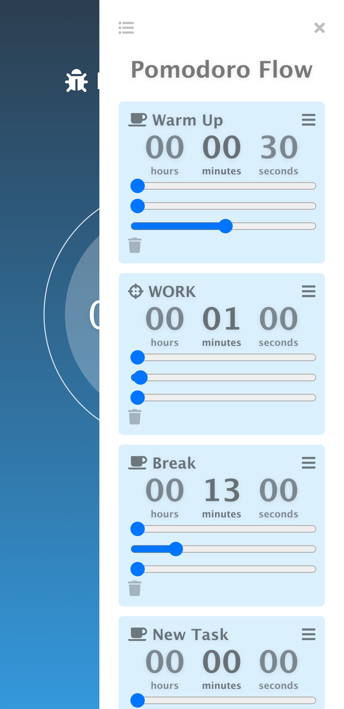
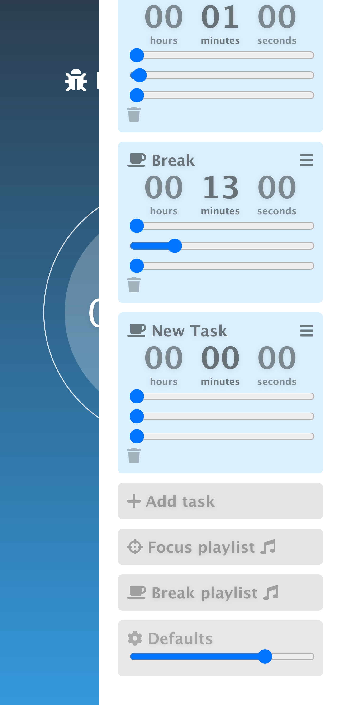

# CIRCADIAN

Helping you get through the rhythms of your day

## DEPENDENCIES

In order to run the app,
you will need the following dependencies:

* node version 12.13.0
* npm version 6.14.1
* postgresql 13 (14 has an issue with ports)
* Express for Node.js
* Vue.js for front-end

```
// to install with homebrew and start postgres
brew install postgresql@13 # last working version to allow connecting to port
brew services start postgresql@13 # starts the server
brew link postgresql@13 # allows you use psql command
psql --version

// might have to run the following if doesn't work
echo 'export PATH="/usr/local/opt/postgresql@13/bin:$PATH"' >> ~/.zshrc

reference: https://dyclassroom.com/howto-mac/how-to-install-postgresql-on-mac-using-homebrew
reference: https://stackoverflow.com/questions/69754628/psql-error-connection-to-server-on-socket-tmp-s-pgsql-5432-failed-no-such
```


## Getting Started

How to run this locally for testing and development

```
# SETUP DATABASE
## create database
$ psql
> \du # to list the users
# if need to create specific user then do that
> CREATE ROLE <DB_USER> WITH createdb login password '<DB_PASSWORD>'
# log out and log back in as new user before creating database

> \l # to list the databases
> CREATE DATABASE <DB_NAME>;
> \l


#// install dependencies
$ npm install

#// run the server
$ npm run start

#// go to app in browser
http://localhost:3000
```


## Screenshots






## TODO:
* deploy to heroku to test and plan out next steps
* create migrations for tasks and users

[x] setup sequelize with express to use postgres database
[x] npx sequelize-cli init // to setup folders needed
[x] npx sequelize-cli model:generate --name Flows --attributes title:string
[x] npx sequelize-cli db:migrate

stretch:
* chrome extension to run spotify playlists
* tmux plugin to have pomodoro in tmux

