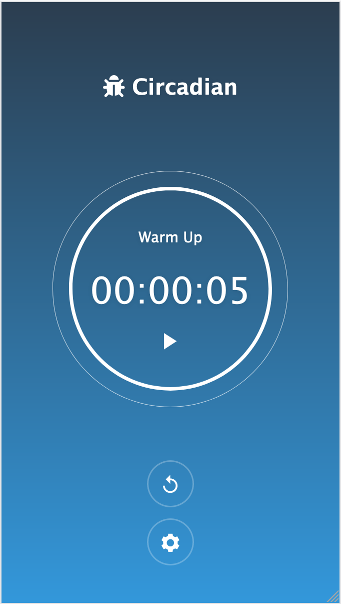
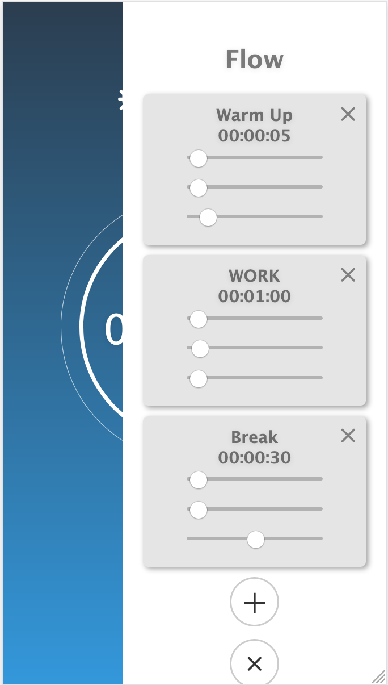

# CIRCADIAN

Helping you get through the rhythms of your day

## Getting Started
 
* run `npm install`
* run `npm start`

* run `npm run build`

## Dependencies

* install nvm: `curl -o- https://raw.githubusercontent.com/nvm-sh/nvm/v0.39.2/install.sh | bash`
* install Node.js: `nvm install 12.13.0`
    * this installs npm also
* Express for Node.js
* Vue.js for front-end

## Screenshots

