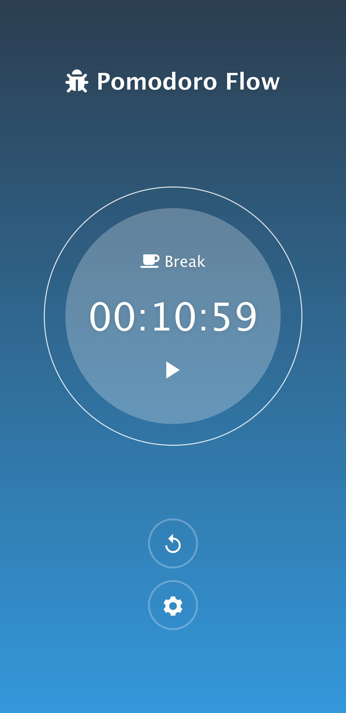

# CIRCADIAN

Helping you get through the rhythms of your day


## Getting Started

How to run this locally for testing and development

```
// install dependencies
npm install

// run the server
npm run start

// go to app in browser
http://localhost:3000
```


## Dependencies

* Express for Node.js
* Vue.js for front-end

## Screenshots




## TODO:
* deploy to heroku to test and plan out next steps
* setup sequelize with express to use postgres database

stretch:
* chrome extension to run spotify playlists
* tmux plugin to have pomodoro in tmux

